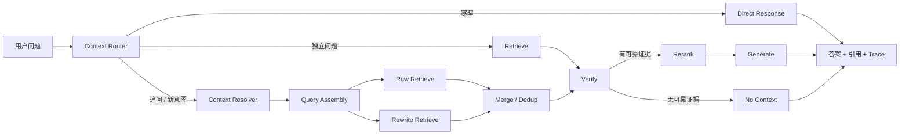

# Enterprise RAG Agent

面向企业文档问答场景的 RAG 服务。系统负责文档上传、解析、分块、向量化、检索、相关性验证、重排序和答案生成，回答会返回实际使用的文档片段，方便核对来源。

问答接口不是直接拼接 Retriever 和 LLM，而是经过 LangGraph 状态图。多轮上下文处理层放在原有 RAG 流程**前面**，不替换原检索链路：



## 功能

- PDF、DOCX、TXT、Markdown 文档解析
- 文档分块、Embedding 和 Chroma 向量存储
- 向量召回、相关性阈值验证和二次重排序
- LangGraph 检索决策工作流
- 多轮上下文改写：指代消解、省略补全、跨轮引用和新意图切断
- 普通问答和真正的 SSE Token 流式输出
- 多轮会话、最近消息上下文和引用来源
- 回答点赞/点踩反馈
- 文档处理状态和失败原因查询
- SQLite 本地运行，MySQL + Docker 部署
- 可选 API Key 鉴权和受限 CORS

## 多轮上下文

三个概念在系统里是分开的，不能混用：

```text
用户原始 Query  ≠  检索 Query
Conversation History  ≠  Active Intent Context
Context Resolution  ≠  Retrieval
```

- **Context Router** 按规则把请求分成四类。`direct` 是寒暄，直接返回固定话术，不碰 Embedding、Chroma、Reranker 和 LLM；`independent` 是自足的单轮问题，不经过上下文层；`continue` 命中指代、省略或序数引用（如“那么B组呢？”“第二条是谁负责？”），需要恢复上下文；`new_intent` 是新的业务意图，清空 `active_context` 但保留 `chat_messages`。
- **Context Resolver** 用 LLM 把省略和指代还原成完整的检索问题，输出 `intent` / `slots` / `retrieval_query`。`slots` 不绑定排班领域，`schedule_query` 的 `group`、`finance_policy` 的 `policy_type` 走的是同一套结构。
- **Query Assembly** 直接采用 Resolver 给出的可靠改写，不会为了形式再调一次 LLM。
- **双路召回** 同时用原始 Query 和改写 Query 检索，按 chunk 唯一 ID `document_id:chunk_index` 合并去重。同一个 chunk 被两路命中时 `raw_score` 和 `rewrite_score` 都保留，重排序基础分取两者较高值，不做覆盖。
- **生成阶段始终使用用户原始 Query**，改写结果只用于检索。

`active_context` 按会话持久化在 `chat_sessions.active_context`，重启不丢；`chat_messages` 始终保存完整聊天记录。Resolver 只喂最近 `CONTEXT_HISTORY_TURNS` 轮，不会把全部历史塞进 Prompt。

任何解析失败 —— 没有配置 LLM、调用超时、返回非法 JSON —— 都会回落到原始 Query 走单路召回，不会让接口 500。系统既允许「改写成功 → 双路召回」，也允许「改写失败 → 原始 Query 继续工作」。

## 技术栈

- Python 3.11+
- FastAPI
- LangGraph / LangChain
- ChromaDB
- SQLAlchemy Async
- SQLite / MySQL
- Docker Compose

## 项目结构

```text
app/
├── api/                 文档、会话、问答和检索接口
├── core/
│   ├── agent.py         LangGraph 工作流与双路召回合并
│   ├── context_router.py    请求分流
│   ├── context_resolver.py  多轮上下文解析
│   ├── document_parser.py
│   ├── embedding.py
│   ├── generator.py
│   ├── reranker.py
│   ├── retriever.py
│   └── vector_store.py
├── models/              SQLAlchemy 数据模型
├── schemas/             请求和响应模型
├── services/            文档处理和会话服务
├── config.py
├── dependencies.py
└── main.py
```

## 本地运行

```bash
python -m venv .venv
```

Windows：

```powershell
.venv\Scripts\Activate.ps1
python -m pip install -r requirements.txt
Copy-Item .env.example .env
uvicorn app.main:app --reload
```

启动后访问：

- Swagger：http://127.0.0.1:8000/docs
- 健康检查：http://127.0.0.1:8000/health
- 就绪检查：http://127.0.0.1:8000/ready

默认配置使用 SQLite、本地 Chroma 和 Hash Embedding，不需要下载模型，也不需要 API Key，可以完整演示上传、检索、重排序、引用和 Agent Trace。

## 使用 BGE 和大模型

需要更好的语义检索时修改 `.env`：

```env
EMBEDDING_BACKEND=bge
EMBEDDING_MODEL=BAAI/bge-small-zh-v1.5

RERANK_BACKEND=cross_encoder
RERANK_MODEL=BAAI/bge-reranker-v2-m3

LLM_API_KEY=your-key
LLM_BASE_URL=https://api.deepseek.com
LLM_MODEL=deepseek-chat
```

BGE 和 Cross Encoder 首次运行时会从 Hugging Face 下载模型。模型实例会在进程内缓存，Embedding、重排序、文档解析和 Chroma 操作都通过线程池执行，不阻塞 FastAPI 事件循环。

如果没有配置 `LLM_API_KEY`，系统会根据命中的文档片段生成抽取式回答，并继续返回引用来源。

## API

### 文档

| 方法 | 路径 | 说明 |
| --- | --- | --- |
| POST | `/api/documents/upload` | 上传并后台处理文档 |
| GET | `/api/documents` | 查询文档列表和处理状态 |
| GET | `/api/documents/{id}` | 查询单个文档 |
| DELETE | `/api/documents/{id}` | 删除文档、文件和向量 |

上传接口返回 `202`。状态会从 `processing` 变成 `ready` 或 `error`，失败原因位于 `error_message`。

### 检索与问答

| 方法 | 路径 | 说明 |
| --- | --- | --- |
| POST | `/api/retrieval/search` | 只执行向量检索，便于调试召回结果 |
| POST | `/api/chat` | LangGraph 完整问答 |
| POST | `/api/chat/stream` | SSE 流式问答 |
| POST | `/api/messages/{id}/feedback` | 点赞或点踩回答 |

普通问答示例：

```bash
curl -X POST http://127.0.0.1:8000/api/chat \
  -H "Content-Type: application/json" \
  -d '{"query":"员工报销需要在多少天内提交？"}'
```

响应中的 `citations` 包含文档 ID、文档名、片段序号、内容预览和重排序分数；`trace` 展示本次请求经过的 LangGraph 节点。

### 会话

| 方法 | 路径 | 说明 |
| --- | --- | --- |
| POST | `/api/sessions` | 创建会话 |
| GET | `/api/sessions` | 查询会话列表 |
| DELETE | `/api/sessions/{id}` | 删除会话及消息 |

## API 保护

部署环境可以配置：

```env
APP_API_KEY=replace-with-a-long-random-value
CORS_ORIGINS=https://your-frontend.example
```

配置后，业务接口必须携带：

```text
X-API-Key: replace-with-a-long-random-value
```

## Docker + MySQL

```bash
Copy-Item .env.example .env
docker compose up --build
```

Compose 会启动 MySQL 8.4 和 API，并等待 MySQL 健康后再启动应用。上传文件、Chroma 数据、MySQL 数据和 Hugging Face 模型缓存都使用独立 volume。

示例密码只用于本地演示，部署前应修改：

```env
MYSQL_PASSWORD=your-password
MYSQL_ROOT_PASSWORD=your-root-password
```

## 测试

```bash
python -m pip install -r requirements-dev.txt
python -m pytest -q
python -m ruff check .
```

测试使用 Fake Retriever、Fake Generator 和 Scripted Resolver，不下载模型、不访问外部 LLM，覆盖：

- LangGraph 正常分支
- 无可靠资料分支
- 问答、引用和反馈
- SSE 流式事件
- 文档后台处理
- 不支持文件类型校验
- Direct Response 不触碰检索与生成
- 多轮改写、跨轮引用和新意图切断
- 双路召回合并去重与重排序基础分取值
- 解析失败回落到原始 Query
- `active_context` 按会话持久化

## Evaluation

```bash
python evaluation/run_retrieval_eval.py
```

脚本在本地构建索引并跑 q01~q23，输出单轮 Hit@K、多轮 Raw / Rewrite / Merged Hit@K、Rewrite Success Rate、Fallback Rate 和验证通过率。多轮用例会调真实 Agent 图校验路由与回落行为，改写结果由 `dataset.json` 标注提供，评测的是检索链路如何处理改写，不是解析器本身的质量。

评测默认使用 hash embedding 和 lexical reranker，分数只反映离线检索链路的行为，**不代表生产语义模型性能**。已知问题：0.05 的 `MIN_RELEVANCE_SCORE` 对 hash embedding 无法有效识别不可回答的问题，`Correct abstention` 为 0，这属于下一阶段的验证策略优化，不在多轮改造范围内。

## 设计边界

- 当前 Chroma 使用单集合存储，生产环境的多租户场景应增加租户字段和权限过滤。
- FastAPI `BackgroundTasks` 适合单机项目；大规模文档处理应替换为消息队列和独立 Worker。
- Hash Embedding 用于零下载演示；需要语义效果时使用 BGE。
- Context Resolver 依赖 LLM。没有配置 `LLM_API_KEY` 时多轮改写不会生效，追问会回落到原始 Query 走单路召回，链路本身仍然可用。
- Context Router 使用规则分流而非模型分类，指代和省略的判定覆盖常见句式，更复杂的表达需要依赖 Resolver。
